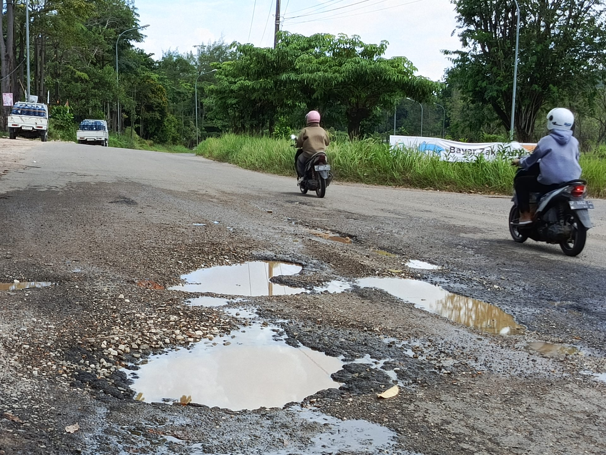
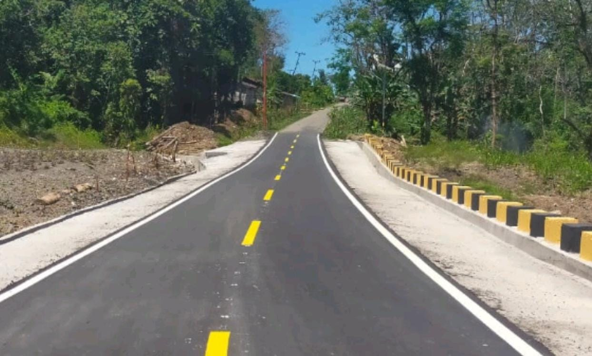

# Streetwatch Model API

API untuk mendeteksi kerusakan jalan dari gambar. Sistem bekerja dalam dua tahap: pertama memvalidasi apakah gambar adalah jalan menggunakan model MobileNetV2, lalu mendeteksi lubang dan tingkat keparahannya menggunakan model YOLOv8.

## Base URL

```
https://firzahakim-streetwatch-model-api.hf.space
```

---

## Endpoints

### `GET /`
Mengecek apakah API berjalan.

**Response:**
```json
{ "status": "ok" }
```

---

### `POST /detect`
Menerima gambar dan mengembalikan hasil deteksi kerusakan jalan.

**Request:**
- Content-Type: `multipart/form-data`
- Body: `file` (file gambar, jpg/png)

**Contoh response:**
```json
{
  "is_road": true,
  "total_potholes": 2,
  "image_severity": "Sedang",
  "detections": [
    {
      "bbox": [310, 184, 414, 214],
      "severity": "sedang",
      "confidence": 0.884
    },
    {
      "bbox": [240, 162, 288, 182],
      "severity": "rendah",
      "confidence": 0.95
    }
  ]
}
```

| Field | Keterangan |
|---|---|
| `is_road` | `true` jika gambar terdeteksi sebagai jalan |
| `total_potholes` | Jumlah lubang yang terdeteksi |
| `image_severity` | Tingkat kerusakan keseluruhan: `Parah`, `Sedang`, `Ringan`, atau `Tidak Ada Kerusakan` |
| `detections[].bbox` | Koordinat bounding box `[x1, y1, x2, y2]` |
| `detections[].severity` | Tingkat keparahan lubang: `parah`, `sedang`, atau `rendah` |
| `detections[].confidence` | Confidence score deteksi (0–1) |

---

## Cara Test

**curl (Linux/Mac):**
```bash
curl -X POST https://firzahakim-streetwatch-model-api.hf.space/detect \
  -F "file=@test-images/rusak-parah.jpg"
```

**curl (Windows CMD):**
```cmd
curl -X POST https://firzahakim-streetwatch-model-api.hf.space/detect -F "file=@test-images/rusak-parah.jpg"
```

**Python:**
```python
import requests

with open("test-images/rusak-parah.jpg", "rb") as f:
    response = requests.post(
        "https://firzahakim-streetwatch-model-api.hf.space/detect",
        files={"file": f}
    )

print(response.json())
```

---

## Contoh Hasil

**`test-images/rusak-parah.jpg`**



```json
{
    "is_road": true,
    "total_potholes": 6,
    "image_severity": "Parah",
    "detections": [
        { "bbox": [241, 964, 1125, 1313], "severity": "parah", "confidence": 0.8887 },
        { "bbox": [533, 794, 971, 953], "severity": "parah", "confidence": 0.8365 },
        { "bbox": [0, 859, 194, 936], "severity": "sedang", "confidence": 0.7065 },
        { "bbox": [1277, 812, 1398, 859], "severity": "rendah", "confidence": 0.6311 },
        { "bbox": [1058, 855, 1671, 1073], "severity": "parah", "confidence": 0.5963 },
        { "bbox": [1000, 722, 1139, 775], "severity": "rendah", "confidence": 0.3149 }
    ]
}
```

---

**`test-images/jalan-normal.jpg`**



```json
{
    "is_road": true,
    "total_potholes": 0,
    "image_severity": "Tidak Ada Kerusakan",
    "detections": []
}
```

---

**`test-images/bukan-jalan.jpg`**


```json
{
    "is_road": false,
    "message": "Gambar tidak terdeteksi sebagai jalan."
}
```